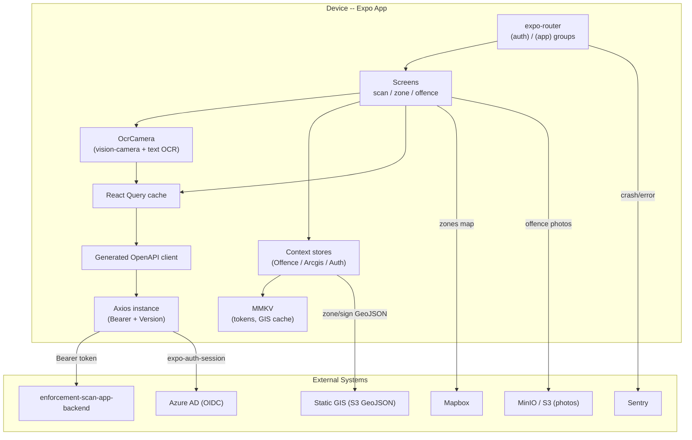
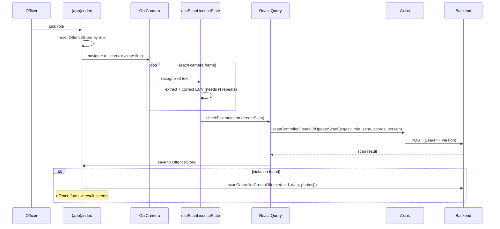

# Enforcement Scan App -- Architecture

## System Overview

The Enforcement Scan App (*Skenovacia aplikácia*) is an internal mobile app for **Bratislava's Municipal Police / city parking enforcement**. An officer picks a role, optionally selects a parking zone on a map, scans a vehicle license plate (**ECV**) with the live camera (OCR), the app checks the plate against the backend, and -- if a violation is found -- the officer creates an offence with photos.

It is a native **Expo / React Native** app (Android-focused) using **expo-router** file-based routing, **TanStack React Query** for server state, **MMKV** for persistence, and a generated typed HTTP client against **`enforcement-scan-app-backend`**. Plate reading is done on-device with `react-native-vision-camera` + a text-recognition (OCR) frame processor. Auth is **Azure AD (Entra ID)** OIDC.

### Environments

Environments are selected by **EAS build profile** (`eas.json`), each with its own `env` block. Treat `eas.json` -- not the committed `.env` (which points at staging with `DEPLOYMENT=development`) -- as the source of truth for deployed builds. Env access is type-checked in `environment.ts` (`assertEnv`).

| Profile | Backend (`EXPO_PUBLIC_API_URL`) | Deployment | Update channel |
|---|---|---|---|
| development | `enforcement-scan-app-backend.dev.bratislava.sk` | development | (dev client) |
| preview | `...dev.bratislava.sk` | development | `preview` |
| staging | `...staging.bratislava.sk` | staging | `staging` |
| prod | `enforcement-scan-app-backend.bratislava.sk` | production | `prod` |
| prod-apk | extends `prod`, APK for InTune (package `com.bratislava.enforcementscanapp`) | production | `prod` |

EAS project id `28f73650-...`, owner `bratislava`, `runtimeVersion.policy: appVersion`.

---

## High-Level Architecture



---

## Routing / Screen Map (`app/`, expo-router)

`app/_layout.tsx` (root) initializes Sentry, the `QueryClient`, fonts, OTA update check (prod), and nests the global providers (`ToastProvider` -> `QueryClientProvider` -> `AuthStoreProvider` -> portal/safe-area/bottom-sheet/gesture-handler -> `OmnipresentComponent` + `<Stack>`); exported via `Sentry.wrap`.

- **`app/(auth)/sign-in.tsx`** -- Azure OIDC login (`useSignIn`).
- **`app/permissions.tsx`** -- camera + location permission onboarding.
- **`app/(app)/_layout.tsx`** -- authenticated layout: loads the Mapbox token, gates on `useAuthStoreContext` (redirect to `sign-in`), wraps children in `OffenceStoreProvider` + `ArcgisStoreProvider`, mounts permission bottom sheets.
- **`app/(app)/index.tsx`** -- home: role picker (filtered by `user.roles`) -> `/zone` or `/scan/licence-plate-camera`.
- **`app/(app)/profile.tsx`**, **`my-offences.tsx`** -- profile and the officer's offence list.
- **Scan group** -- `scan/licence-plate-camera.tsx` (OCR scan), `scan/info.tsx`.
- **Zone group** -- `zone/index.tsx` (Mapbox zone selector), `zone/photo-camera.tsx`, `zone/photo.tsx`.
- **Offence group** (`app/(app)/offence/`) -- `index.tsx` (form), `offence-type.tsx`, `resolution-type.tsx`, `vehicle.tsx`, `location.tsx`, `result.tsx`, `photos/{index,library,detail}.tsx`.

---

## Directory Map

| Directory | Purpose |
|---|---|
| `app/` | expo-router routes (above). |
| `components/` | UI + feature components: `camera/` (`OcrCamera`, `FullScreenCamera`, plate camera, flashlight), `map/` (Mapbox `Map`, `MapZones`, camera, bottom sheets), `screen-layout/`, `shared/`, `special/` (`OmnipresentComponent`, `StoreVersionControl`, permission sheets, `DuplicityModal`). |
| `modules/backend/` | API layer: `client-api.ts`, `axios-instance.ts`, `openapi-generated/`, `constants/` (`queryOptions.ts`, `roles.ts`, `resolutionTypes.ts`), `hooks/useAxiosResponseInterceptors.ts`, `utils/fix-client.js`. |
| `modules/auth/` | Azure OIDC auth: token hooks, `state/AuthStoreProvider`, `utils.ts` (token->user/roles). |
| `modules/camera/` | `useScanLicencePlate`, flashlight context, plate correction/format helpers. |
| `modules/map/` | Mapbox + geo hooks and turf utilities (`findContainingFeature`, distance, city-bounds), `state/MapStoreProvider`. |
| `modules/arcgis/` | Static + live GIS (zone/sign GeoJSON) fetching + caching. |
| `modules/permissions/` | camera + location permission hooks. |
| `hooks/` | App-wide hooks (`useAppState`, `useQueryWithFocusRefetch`, `useOffenceValidation`, ...). |
| `state/` | Global stores: `OffenceStore/` (offence-in-progress), `ArcgisStore/` (processed zone/sign GeoJSON). |
| `utils/` | `mmkv.ts`, `store.ts` (subscription store), image helpers (text/GPS stamping, CDN URLs), plate sanitizer, formatters, `cn`. |
| `translations/` | `sk.json` (Slovak only). |
| `.maestro/` | E2E flows (`login`, `create-offence`, `create-paas-offence`). |

---

## Data Layer & State

- **React Query** -- `QueryClient` in `app/_layout.tsx` (`retry: 1`, `gcTime: 1h`). Query definitions centralized in `modules/backend/constants/queryOptions.ts` via `queryOptions()` + `skipToken` (vehicle properties, tickets/permits by ECV, offence overview, offence types, zone-sign photos, mobile-app version). Mutations live in hooks (`useScanLicencePlate`, `useCreateOffence`).
- **Generated OpenAPI client** -- `modules/backend/openapi-generated/`, regenerated by `yarn generate-clients` from the staging backend's `/api-json`, post-processed by `modules/backend/utils/fix-client.js`. `client-api.ts` composes `ScansAndOffencesApiFactory` + `MobileAppApiFactory` bound to `environment.apiUrl` and the shared axios instance. See **Generated API Client**.
- **Persisted state (MMKV)** -- single instance in `utils/mmkv.ts`: auth tokens (`authentication_tokens`), locale (`settings.locale`), and ArcGIS GeoJSON HTTP cache keyed by URL with ETag validation.
- **Custom context stores** (`utils/store.ts`, context + external subscription):
  - **`OffenceStore/`** -- the offence-in-progress state machine (role, ecv, scanData, location, offenceType, resolutionType, photos, zone, zonePhoto, vehicleId); `useSetOffenceState` writes, `useOffenceStoreContext` reads, `useCreateOffence` submits.
  - **`ArcgisStore/`** -- processed UDR zone + sign GeoJSON.

---

## Authentication & Authorization

**Azure AD (Entra ID) OIDC via `expo-auth-session` (PKCE).**

1. Endpoints built from `login.microsoftonline.com/{tenantId}/oauth2/v2.0` (`modules/auth/hooks/useAuthTokens.ts`); scopes `api://{clientId}/user_auth`, `user.read`, `offline_access`.
2. Sign-in (`modules/auth/hooks/useSignIn.ts`) uses `useAuthRequest` + `exchangeCodeAsync`, redirect scheme `enforcement-scan-app://sign-in`.
3. Tokens (an `expo-auth-session` `TokenResponse`) are stored in MMKV (`authentication_tokens`); `modules/auth/utils.ts` `getUserFromTokens()` uses **`jwt-decode`** to read `name`, email, and **`roles[]`**.
4. On boot, `AuthStoreProvider` validates token freshness and refreshes via `refreshAsync` if needed.
5. **Token attachment** -- `modules/backend/axios-instance.ts` request interceptor reads MMKV tokens and sets `Authorization: Bearer <accessToken>` + a `Version` header. On 401, `useAxiosResponseInterceptors.ts` refreshes and retries, else logs out.

**Authorization (roles):** `modules/backend/constants/roles.ts` defines `ROLES` (`paas`, `municipal-police`, `research`) with per-role allowed actions, scan reasons, resolution types and offence types. The home screen filters roles by the user's `roles[]`.

---

## External Integrations

| Integration | Where | Purpose |
|---|---|---|
| **enforcement-scan-app-backend** | `modules/backend/*` | Plate scan/lookup, offence creation, vehicle/permit/ticket info, offence lists, app-version force-update, zone-sign photo upload. |
| **Azure AD** | `modules/auth/*` | Authentication + role source. |
| **Mapbox** | `components/map/*`, `app/(app)/_layout.tsx` | Parking-zone map. Point-in-zone via `@turf/boolean-point-in-polygon` (`modules/map/utils/findContainingFeature.ts`). |
| **Static GIS (S3)** | `modules/arcgis/*` | Zone (`udr_p.geojson`) + traffic-sign (`znacky.geojson`) GeoJSON from `bratislava-static-assets` S3, cached in MMKV (ETag). |
| **Camera / OCR** | `components/camera/OcrCamera.tsx`, `modules/camera/hooks/useScanLicencePlate.ts` | Live-camera plate recognition (see below). |
| **Sentry** | `app/_layout.tsx`, `app.config.js` | Crash/error reporting (production only). |
| **MinIO / S3** | `utils/addImageCdnUrl.ts` | Offence/zone photo storage/CDN. |

### Camera / OCR pipeline

`OcrCamera.tsx` runs a `useFrameProcessor` worklet calling `useTextRecognition().scanText(frame)`, marshaled to JS with `useRunOnJS`. `useScanLicencePlate.ts` picks the largest text block matching `ECV_FORMAT_REGEX`, corrects it (`correctLicencePlate.ts`), and only accepts a plate seen the required number of times. Photos are stamped with timestamp text (`react-native-image-marker`) and GPS EXIF (`@lodev09/react-native-exify`). Two patches (`patches/`) fix native OCR/image-marker null handling on install.

---

## Data Lifecycle -- Scan -> Offence



The offence form (`app/(app)/offence/*`) collects type/resolution/vehicle/photos/location; `state/OffenceStore/useCreateOffence.ts` validates, stamps photos, and submits `scanControllerCreateOffence` (multipart) before routing to `offence/result.tsx`.

---

## Localization

- `i18n.config.js` -- i18next + react-i18next, single locale **`sk`** from `translations/sk.json`, imported once in `app/_layout.tsx`.
- Extraction: `i18next-parser.config.js` scans `(app|components|modules)/**` -> `translations/sk.json` (flat keys). Locale persisted in MMKV (`settings.locale`).

---

## Generated API Client

The backend client is generated, not hand-written:

```
yarn generate-clients
# openapi-generator-cli generate -i <staging>/api-json -g typescript-axios
#   -o modules/backend/openapi-generated && node modules/backend/utils/fix-client.js
```

- Source of truth: the staging `enforcement-scan-app-backend` OpenAPI spec.
- Output post-processed by `fix-client.js` (types `options` as `RawAxiosRequestConfig`). Config in `openapitools.json`.

Regenerate rather than editing generated files by hand when the backend changes.

---

## Deployment

- **EAS Build (`eas.json`)** -- profiles above; `appVersionSource: remote`, auto-increment on staging/prod; submit to Google Play `internal` (draft). InTune distribution uses the `prod-apk` APK profile.
- **OTA updates (`expo-updates`)** -- update URL + `runtimeVersion.policy: appVersion` in `app.config.js`; production launches auto check/fetch/reload. `ota-*` tags publish OTA instead of a full build.
- **Force update** -- `StoreVersionControl.tsx` polls `systemControllerGetMobileAppVersion`; if the backend minimum version exceeds the installed `APP_VERSION`, it shows an update modal. `APP_VERSION` is also sent as the `Version` header on API calls.
- **CI (`.github/workflows/`)** -- `build.yml` (tags `prod**`/`staging**` -> `eas build`/`eas update`), `validate.yml` (PR: TS check + ESLint), `codeql-analysis.yml`.
- **E2E** -- Maestro flows in `.maestro/`.

---

> **Keep this doc in sync:** if a code change updates something described here (routing, scan/offence flow, auth, integrations, deployment), update this `ARCHITECTURE.md` in the same change.
